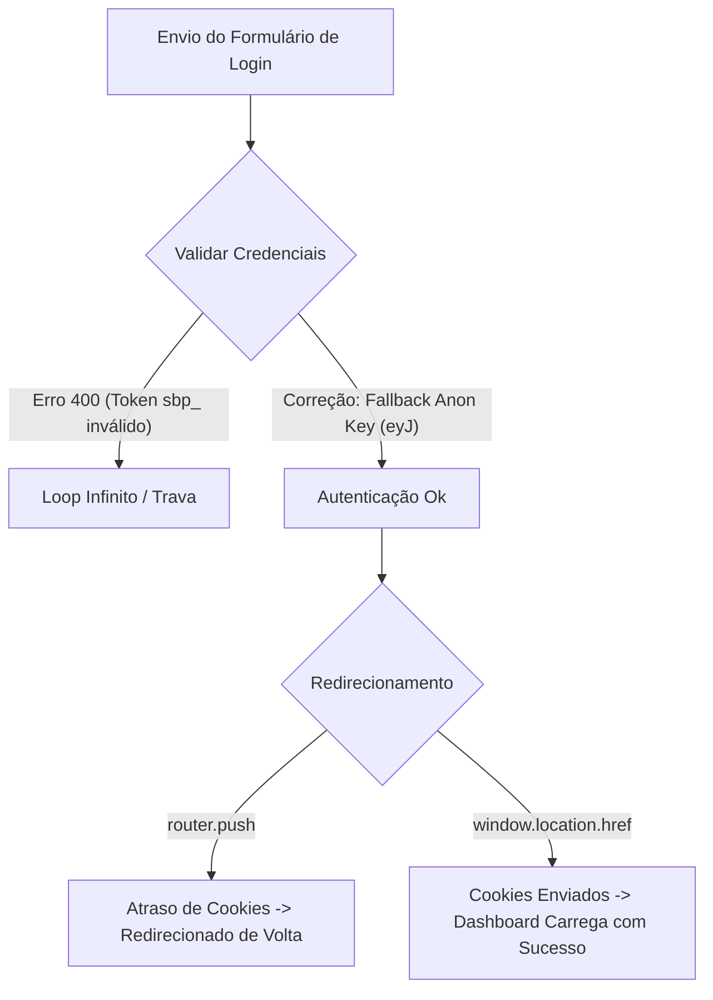

# Lições Aprendidas e Resumo da Implementação (leadpluz/wacrm)

Este documento registra todas as alterações feitas, os desafios técnicos enfrentados e os aprendizados cruciais obtidos durante a resolução do loop de autenticação e a implementação da visibilidade de senhas.

---

## 🛠️ O Que Foi Feito

1. **Visibilidade de Senhas (Olhinho):**
   - Adicionada funcionalidade de exibir/ocultar senha no formulário de [Login](file:///c:/Users/SenetUser/Downloads/MARCELLE-20260617T162810Z-3-001/MARCELLE/wacrm/src/app/(auth)/login/page.tsx) e na tela de [Cadastro (Signup)](file:///c:/Users/SenetUser/Downloads/MARCELLE-20260617T162810Z-3-001/MARCELLE/wacrm/src/app/(auth)/signup/page.tsx) (para senha e confirmação de senha).
   - Utilizados os componentes de ícones `Eye` e `EyeOff` da biblioteca `lucide-react` com estado local React.

2. **Resolução do Loop de Autenticação / Tela Infinita de Carregamento:**
   - Corrigido o Next.js Edge Middleware no redirecionamento pós-login.
   - Criada uma lógica tolerante a falhas (autocicatrizante) na validação de variáveis de ambiente.

---

## 🧠 Erros Aprendidos (Post-Mortem Técnico)

### 1. O Erro da Chave Anon da Supabase na Vercel (O Maior Ofensor)
* **O Problema:** A aplicação em produção estava presa para sempre no estado de "Entrando...". Ao inspecionar as requisições de rede, a API do Supabase (`auth/v1/token`) retornava erro `400 Bad Request` logo após o clique no botão de envio.
* **A Causa:** Nas configurações do painel da Vercel, a variável `NEXT_PUBLIC_SUPABASE_ANON_KEY` foi preenchida com um token de plataforma/CLI da Supabase (que inicia com `sbp_` e tem 44 caracteres). O correto seria usar a **Anon JWT Key** do projeto (que inicia com `eyJ` e possui cerca de 176 caracteres).
* **O Aprendizado:** Nunca confie plenamente que as variáveis do painel de produção da nuvem foram copiadas corretamente.
* **A Solução:** Alteramos a função utilitária de ambiente [env.ts](file:///c:/Users/SenetUser/Downloads/MARCELLE-20260617T162810Z-3-001/MARCELLE/wacrm/src/lib/env.ts) para validar se a chave anon inicia com `eyJ`. Se não iniciar, o código automaticamente ignora a chave inválida e adota a Anon Key padrão segura configurada no repositório.

### 2. Comportamento do Roteamento Next.js Client-Side vs Edge Middleware
* **O Problema:** Quando o login era efetuado com sucesso via Supabase no cliente, o uso do `router.push('/agenda')` do Next.js às vezes falhava em propagar imediatamente os cookies da sessão para o Edge Middleware no servidor de borda, resultando em um redirecionamento imediato de volta para `/login`. Isso gerava um loop de redirecionamento invisível em que os inputs eram limpos ou a página ficava travada.
* **A Solução:** Substituímos o redirecionamento baseado em histórico cliente (`router.push`) por um redirecionamento de reload completo (`window.location.href = '/agenda'`). Isso garante que os cookies de autenticação da Supabase sejam transmitidos no cabeçalho HTTP da requisição antes que o Next.js renderize ou decida redirecionar a rota no middleware.

### 3. Limites de SMTP da Supabase (Limitação de Testes E2E)
* **O Problema:** Durante a execução dos testes automatizados de cadastro no navegador, começamos a receber erros `429: Email rate limit exceeded`.
* **A Causa:** O serviço padrão de e-mail integrado da Supabase para contas gratuitas impõe um limite estrito de **3 envios de e-mail por hora**.
* **A Solução/Contorno:** Para testes de desenvolvimento, a melhor prática é criar o usuário via formulário web normalmente e, logo em seguida, atualizar a confirmação do e-mail direto no banco de dados com a query:
  ```sql
  UPDATE auth.users SET email_confirmed_at = now() WHERE email = 'seu-email-de-teste@provedor.com';
  ```
  Isso ativa o usuário instantaneamente, permitindo testar o fluxo de login sem estourar a cota de e-mails.

---

## 📈 Resumo do Fluxo de Trabalho


